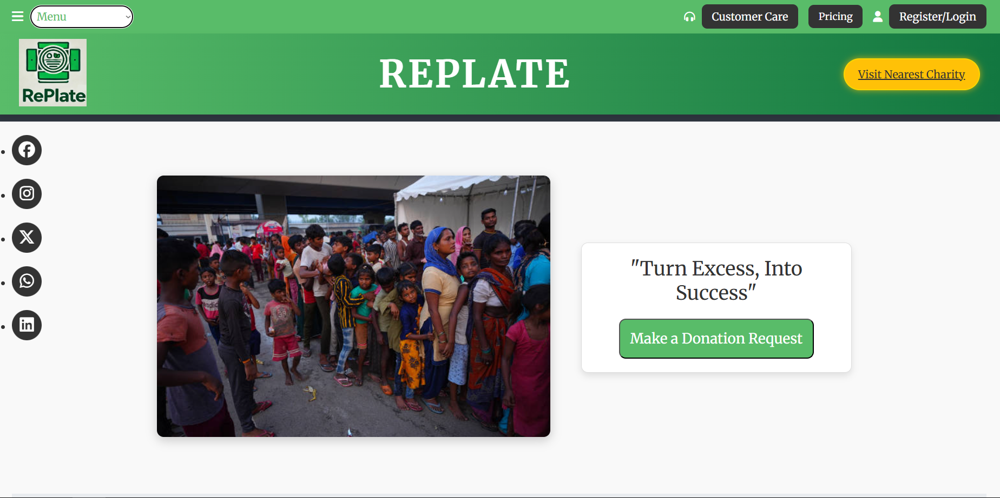

# 🥘 Replate

A smart and efficient food waste management platform that connects restaurants with nearby charities and food banks to redistribute surplus food in real-time and reduce food insecurity.

---

## 📌 Problem Statement

Every day, restaurants and food businesses dispose of large quantities of edible food due to logistical barriers, lack of coordination, and the absence of real-time donation systems. Simultaneously, millions of people in urban and rural areas go to bed hungry. Existing food donation mechanisms are fragmented, inefficient, and often fail to match surplus food with those in need in time. Replate aims to bridge this gap by creating a platform that connects food donors, NGOs, and volunteers in real-time to ensure that surplus food reaches the needy instead of ending up in landfills.

---

## 💡 Features

- 🍱 Real-time food pickup requests from restaurants
- 🧭 Geo-based matching of restaurants and NGOs/charities
- 📊 Dashboard for donors and receivers
- 🔔 Instant notifications to volunteers
- 📅 Schedule pickups and track donations
- 🔐 Authentication and role-based access

---

## 🛠️ Tech Stack

| Layer         | Technology Used             |
|---------------|-----------------------------|
| Frontend      | HTML, CSS, JavaScript |
| Backend       | Flask, Node.js       |
| Database      | MongoDB     |
| APIs / Tools  | Google Maps API     |

---

## 🚀 Installation & Setup

> Note: The project is a prototype and not fully deployed

1. Clone the repository  
   ```bash
   git clone https://github.com/aryandas2911/RePlate.git
   cd replate
   
---

## 📷 Preview 


---

##🔮 Future Scope

AI-powered surplus prediction

Donation impact tracker for restaurants

Mobile app integration for volunteers

Partnership onboarding system
